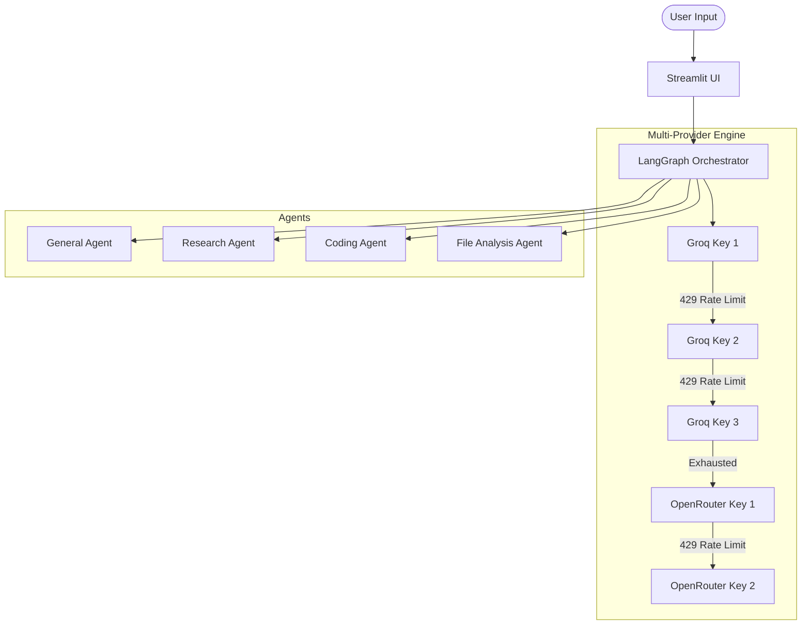

# OmniForge AI Agent

A highly resilient, multimodal AI agent built with LangChain, LangGraph, Streamlit, and a powerful **Multi-Provider Fallback Engine**.

OmniForge dynamically routes user requests to specialized sub-agents (General, Research, Coding, File Analysis, Media) and executes them using a resilient LLM chain that seamlessly switches between API keys and providers (Groq ↔ OpenRouter) to completely eliminate rate-limiting crashes.

## 🌟 Key Features

| Capability | Description |
|---|---|
| 🔄 **Multi-Key Fallback** | Zero-downtime execution. Automatically cycles through 3 Groq keys and 3 OpenRouter keys if rate limits (HTTP 429) are hit. |
| 🧠 **Supervisor Routing** | Intelligent LangGraph orchestration routes tasks to specialized worker agents. |
| 🔍 **Web & Academic Research** | Multi-source search (DDGS, Brave, SearXNG, arXiv, Semantic Scholar). |
| 📝 **URL Extraction** | Jina AI Reader integration for seamless webpage scraping. |
| 💻 **Coding & Sandbox** | Writes, executes, debugs, and repairs Python code in an isolated workspace. |
| 💾 **Persistent Memory** | SQLite-backed long-term memory remembers user context across sessions. |
| 📊 **Document Analysis** | Native parsing for PDF, DOCX, CSV, XLSX, JSON, and Text files. |
| 🛠️ **MCP Ready** | Architecture supports Model Context Protocol (MCP) tool servers. |
| 👁️ **Observability** | Full LangSmith tracing integration for debugging and telemetry. |

## 🏗️ Architecture



## 🚀 Quick Start

### Prerequisites
- Python 3.12+
- [uv](https://docs.astral.sh/uv/) package manager

### Installation

```bash
git clone https://github.com/mudassar2224/-OmniForge_AI_Agent--LLMs.git
cd -OmniForge_AI_Agent--LLMs

# Install dependencies using uv
uv sync

# Configure environment variables
cp .env.example .env
```

### Running the App
```bash
uv run streamlit run app.py
```
The app will open at `http://localhost:8501`.

---

## ⚙️ Environment Configuration (`.env`)

OmniForge is designed for high availability. It requires multiple API keys to function optimally.

### Primary LLM Providers (Required)
| Variable | Description |
|---|---|
| `GROQ_API_KEY_1`, `2`, `3` | Groq API keys for ultra-fast LLaMA/Qwen inference. |
| `OPENROUTER_API_KEY_1`, `2`, `3` | OpenRouter API keys used as a reliable fallback. |

### Optional Integrations (Highly Recommended)
| Variable | What it enables |
|---|---|
| `LANGSMITH_API_KEY` | Tracing and observability (Set `LANGSMITH_TRACING=true`). |
| `JINA_API_KEY` | Higher rate limits for full-page URL text extraction. |
| `BRAVE_SEARCH_API_KEY` | High-quality web search fallback. |
| `SEMANTIC_SCHOLAR_API_KEY` | Academic paper search. |
| `SEARXNG_URL` | Private meta-search engine URL. |
| `GITHUB_TOKEN` | Authenticated GitHub repository/code search. |

## ☁️ Deployment (Streamlit Community Cloud)

To deploy OmniForge to Streamlit Community Cloud:
1. Connect your GitHub repository to [share.streamlit.io](https://share.streamlit.io).
2. Set the main file path to `app.py`.
3. Open **Advanced Settings** > **Secrets**.
4. Paste the exact contents of your `.env` file into the Secrets text box. Streamlit natively parses `.env` formatted variables!

*Note: Streamlit Community Cloud uses an ephemeral file system. Your SQLite `data/` directory (Long-Term Memory) will reset when the server goes to sleep. For permanent memory in the cloud, you must attach an external database (e.g., Postgres).*

## 🧪 Testing

Run the full pytest suite:
```bash
uv run pytest tests/ -v
```

---
**Author:** Mudassar  
**License:** MIT
